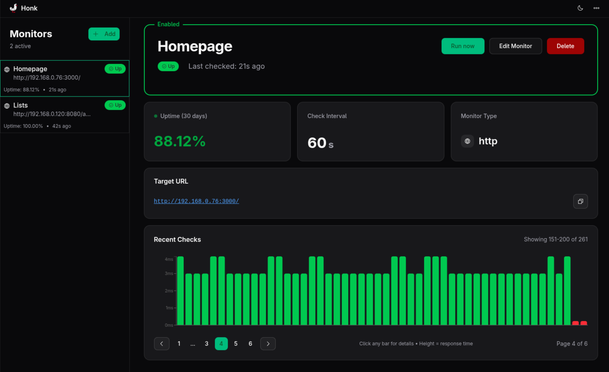
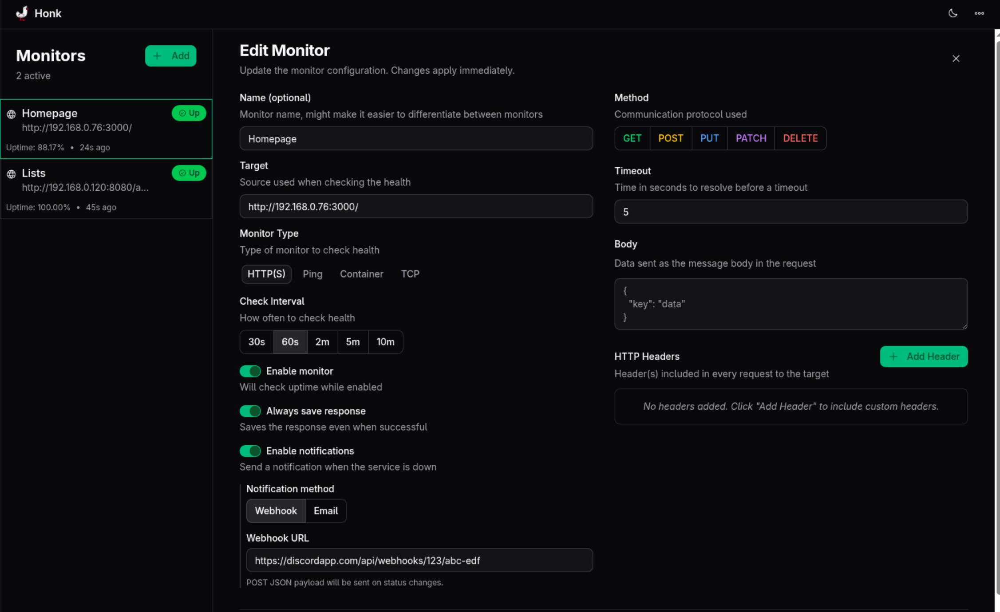

##  Honk

_Need a goose to honk at you when a service is experiencing issues?_

An uptime tracker written in Golang with a minimal React/TailwindCSS frontend.

> [!WARNING]
> Honk is still in version 0.x.x and is subject to major changes from version to version.  
> Feedback is appreciated as bugs are to be expected.

> home
> 

> detail
> 
